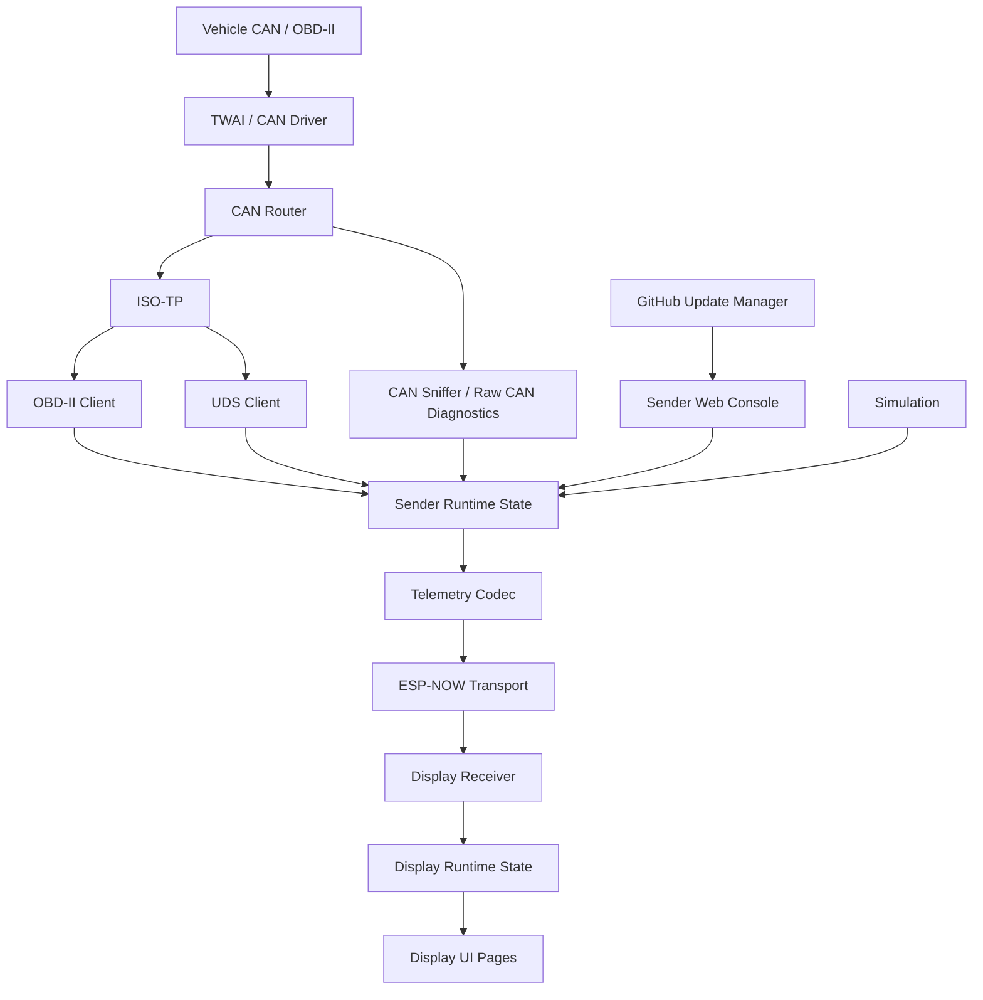

# 00 - Master Design Document

## Contents

- [Project vision](#project-vision)
- [Current firmware baseline](#current-firmware-baseline)
- [Design goals](#design-goals)
- [Architecture principles](#architecture-principles)
- [High-level architecture](#high-level-architecture)
- [Project structure](#project-structure)
- [Current implementation state](#current-implementation-state)
- [Development strategy](#development-strategy)
- [Definition of done](#definition-of-done)
- [References](#references)

## Project vision

CANOBD2Reader is a two-device vehicle dashboard and diagnostics platform:

- **Sender**: ESP32 DevKit V1 connected to the vehicle CAN/OBD-II interface.
- **Display**: LilyGO T-Display S3 receiving telemetry and rendering a driver-readable dashboard.

The project should provide reliable live values, safe read-only diagnostics, OTA updates, simulation support and a path toward vehicle-specific discovery for values that are not available through standard OBD-II.

## Current firmware baseline

This documentation describes the repository state around firmware `V2.0.0.b6`.

Important current decisions:

- Sender and display are separate PlatformIO environments.
- `include/Config.h` has been removed; configuration is split under `include/config/`.
- OTA metadata uses schema/target/version/protocol-range checks instead of a growing compatibility-version list.
- The dedicated display boost page and dedicated RPM graph page are removed for now.
- OBD live polling is split into fast and slow PID groups to improve perceived live-data speed.
- GitHub update/rollback support exists through shared web/update modules and a device-facing manifest.

## Design goals

- Keep sender and display as separate firmware targets in one PlatformIO project.
- Prefer typed protocols and central enums over duplicated string logic.
- Keep diagnostics read-only and user-triggered unless explicitly documented otherwise.
- Keep OTA functional at every step.
- Make simulation good enough to test sender/display contracts without a vehicle.
- Make future VW MQB/MQB Evo extensions possible without hard-coding unsafe behavior.
- Keep local development on Windows straightforward through scripts.

## Architecture principles

- **Modularity**: CAN, ISO-TP, OBD, UDS, telemetry, web, power, update and display code are separate modules.
- **Maintainability**: small classes, clear ownership and documented responsibilities.
- **Extensibility**: new PIDs, DIDs, display pages and web APIs should be additive.
- **Testability**: protocol and runtime logic should compile under the `native` test environment.
- **OTA compatibility**: partitioning, firmware metadata and target validation are mandatory.
- **Platform isolation**: hardware-specific code stays behind Arduino/ESP32 boundaries.
- **Safety first**: UDS/CAN discovery is passive or read-only by default.

## High-level architecture



## Project structure

```text
CANOBD2Reader/
├── platformio.ini
├── VERSION.txt
├── include/
│   ├── common_config.h
│   ├── secrets.example.h
│   └── config/
├── lib/
│   ├── can_router/
│   ├── capabilities/
│   ├── common/
│   ├── display/
│   ├── isotp/
│   ├── logging/
│   ├── network/
│   ├── obd/
│   ├── power/
│   ├── runtime/
│   ├── simulation/
│   ├── status/
│   ├── telemetry/
│   ├── transport/
│   ├── uds/
│   ├── update/
│   └── web/
├── src/
│   ├── sender/
│   └── display/
├── test/
├── scripts/
├── docs/
└── .github/
```

For details see [02_Project_Structure.md](02_Project_Structure.md).

## Current implementation state

### Sender

The sender auto-starts by default and must not depend on a web button for normal vehicle operation. It sends regular heartbeat/status telemetry independent of successful OBD replies.

Important sender modules:

- CAN/TWAI handling and CAN router.
- ISO-TP transport.
- OBD scheduler with fast/slow PID groups.
- UDS scheduler and read-only capability logic.
- ESP-NOW telemetry transport.
- Power/activity monitoring.
- Persistent diagnostic log.
- Web console with status, diagnostics, OTA/update and simulation controls.

### Display

The display renders a compact page set:

1. Main driving values.
2. Engine values.
3. Consumption/trip.
4. Compact diagnostics.
5. UDS/DTC.
6. CAN sniffer/raw diagnostics.
7. Additional values.
8. Power management.

Empty values should be shown as unavailable or replaced by useful raw diagnostic data; they must not appear as green OK values.

### Updates and OTA

Web-OTA and GitHub updates share metadata validation:

- metadata schema
- firmware target
- firmware version
- protocol range
- firmware size/OTA space
- SHA256 for downloaded GitHub firmware

Rollback is manual only. Automatic updates must only move forward.

### Documentation and scripts

Human-maintained documentation lives in numbered files under `docs/`. Auto-generated references are marked with `AUTO_` and produced by scripts in `scripts/`. See [27_Scripts.md](27_Scripts.md).

## Development strategy

### Phase 1 - Stabilize

- Keep sender auto-starting without web interaction.
- Keep heartbeats independent from OBD success.
- Keep OBD live values responsive through fast PID scheduling.
- Keep OTA metadata and target checks reliable.
- Keep native tests green.

### Phase 2 - Make diagnostics useful

- Finish OBD capability scanner UI.
- Finish UDS capability scanner and read-only DID workflow.
- Improve CAN sniffer workflow with baseline/diff/export.
- Improve display raw CAN/HEX visibility.

### Phase 3 - Improve user experience

- Refine display page layouts.
- Improve refresh rates and page-specific value priorities.
- Make web console actions visible and debuggable.
- Keep iPhone-sized web UI usable without horizontal scrolling.

### Phase 4 - Vehicle-specific profiles

- Add profile-based defaults for VW MQB/MQB Evo.
- Keep profiles optional and read-only.
- Store discovered capabilities safely only after explicit user action.

## Definition of done

A change is done when:

- `pio run -e sender` succeeds for sender-affecting changes.
- `pio run -e display` succeeds for display-affecting changes.
- `pio test -e native` succeeds for portable logic changes.
- OTA compatibility is not broken.
- Sender/display telemetry compatibility is preserved.
- Documentation is updated when behavior or architecture changes.
- Remaining hardware validation is explicitly listed.

## References

- [Architecture](01_Architecture.md)
- [Project structure](02_Project_Structure.md)
- [OBD](08_OBD.md)
- [UDS](09_UDS.md)
- [Display](12_Display.md)
- [OTA](16_OTA.md)
- [Testing](18_Testing.md)
- [Scripts](27_Scripts.md)
- [Roadmap](25_Roadmap.md)
