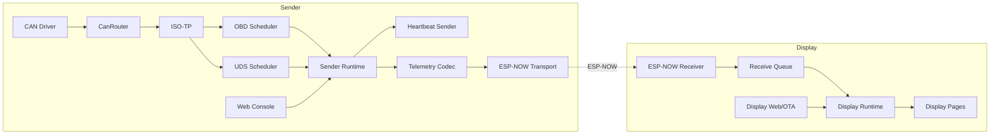
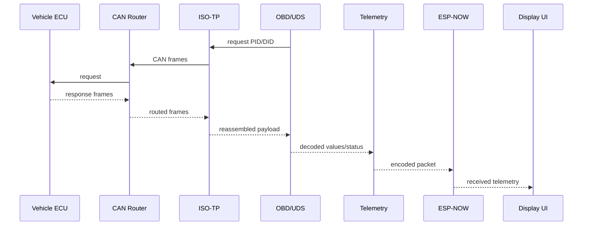

# 01 - Architecture

## Contents

- [Overview](#overview)
- [Current state](#current-state)
- [Target state](#target-state)
- [Data flow](#data-flow)
- [Module responsibilities](#module-responsibilities)
- [Migration plan](#migration-plan)
- [References](#references)

## Overview

The project is split into two PlatformIO environments:

- `sender`: reads CAN/OBD/UDS data and sends telemetry.
- `display`: receives telemetry and renders dashboard pages.

Shared modules live in `lib/` and static configuration lives in `include/config/`.

## Current state

The repository already contains separated sender/display entry points, shared telemetry, ISO-TP, OBD, UDS, simulation, runtime, web and power modules. Some UI rendering and web assets are still concentrated in larger files and should continue to be split over time.

## Target state

The target architecture keeps every responsibility in one primary module:

## Data flow

## Module responsibilities

| Module | Responsibility |
| --- | --- |
| `can_router` | Fan-out CAN frames to registered consumers. |
| `isotp` | ISO 15765-2 segmentation and reassembly. |
| `obd` | Standard OBD-II PID decoding and derived values. |
| `uds` | Read-only UDS services and diagnostic decoding. |
| `capabilities` | OBD/UDS/CAN scan result structures and helpers. |
| `telemetry` | Packet format, CRC, sequence and typed payloads. |
| `transport` | ESP-NOW sender/display transport boundary. |
| `runtime` | Mutable runtime state. |
| `web` | Shared authentication, OTA and web status helpers. |
| `simulation` | Deterministic test scenarios. |
| `power` | Activity scoring and vehicle state detection. |
| `display` | Shared display severity and UI logic helpers. |

## Migration plan

1. Keep monolithic files working while extracting small units.
2. Add native tests before moving protocol logic.
3. Move duplicate web HTML/JS into shared assets.
4. Move display pages into page/widget modules when layout stabilizes.
5. Remove legacy paths only after no include/build path references them.

## References

- [Project structure](02_Project_Structure.md)
- [Telemetry](10_Telemetry.md)
- [Sender](13_Sender.md)
- [Display](12_Display.md)

