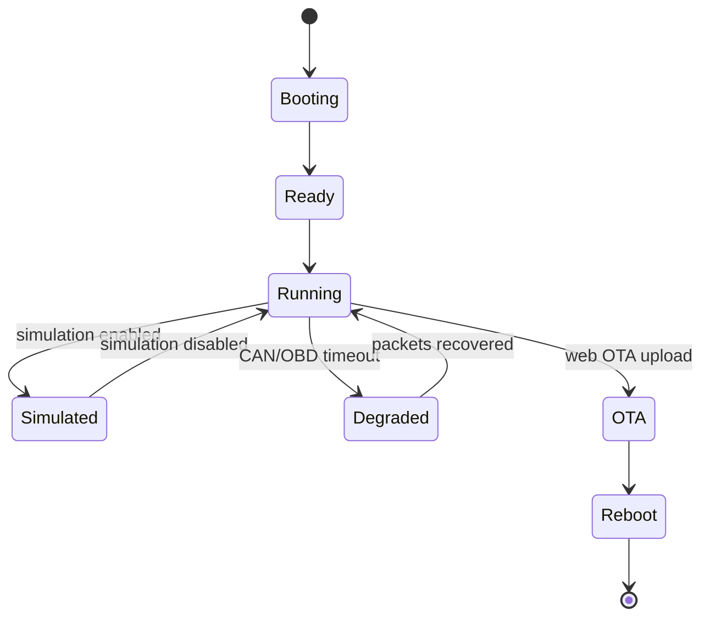

# 05 - Runtime

## Contents

- [Overview](#overview)
- [Current state](#current-state)
- [Runtime types](#runtime-types)
- [Lifecycle](#lifecycle)
- [Target state](#target-state)
- [Migration plan](#migration-plan)

## Overview

Runtime state is mutable state collected while the firmware is running: last CAN activity, telemetry sequence numbers, capability scan status, OTA status, simulation status and display status.

## Current state

Runtime code lives in `lib/runtime/`:

- `SenderRuntimeState.h`
- `DisplayRuntimeState.h`
- `WebRuntimeStatus.h`
- `SenderLoopState.h`
- `SenderRuntimeCoordinator.*`

## Runtime types

| Runtime | Purpose |
| --- | --- |
| Sender runtime | Stores decoded values, protocol status, counters and last errors. |
| Display runtime | Stores received packet state, stale-value flags and page data. |
| Web runtime | Exposes status snapshots to `/status` and web pages. |
| Simulation runtime | Tracks runtime-only simulation enable/scenario state. |
| Power runtime | Tracks vehicle state and display sleep/wakeup commands. |

## Lifecycle

## Target state

All web pages and display pages should read immutable snapshots from runtime state instead of reaching into protocol internals.

## Migration plan

1. Keep adding snapshot helpers for web/display.
2. Avoid direct access to scheduler internals from UI code.
3. Add native tests for every runtime state transition.

