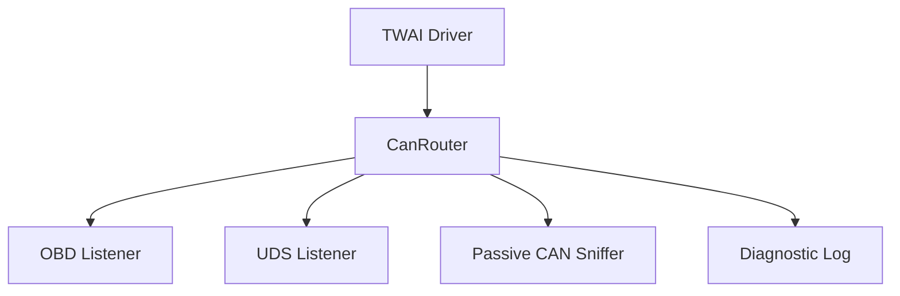

# 06 - CAN Architecture

## Contents

- [Overview](#overview)
- [Current state](#current-state)
- [CAN router](#can-router)
- [TWAI driver lifecycle](#twai-driver-lifecycle)
- [Sniffer](#sniffer)
- [Target state](#target-state)

## Overview

The sender uses ESP32 TWAI hardware to communicate on the vehicle CAN bus. CAN access must be centralized so OBD, UDS and sniffing do not steal frames from each other.

## Current state

`lib/can_router/` provides a router and hub concept. Sender code routes received frames toward OBD/UDS and capability/sniffer components.

## CAN router

## TWAI driver lifecycle

The sender should always cleanly handle:

1. `twai_driver_install()`
2. `twai_start()`
3. alert monitoring
4. `twai_stop()`
5. `twai_driver_uninstall()`

On failure, partial initialization must be rolled back before retrying.

## Sniffer

The CAN sniffer must be passive by default. Its job is to detect changed identifiers/bytes/bits after a baseline was captured. It must not send CAN frames.

## Target state

- One CAN receive path.
- All consumers register as listeners.
- Hardware alerts are exposed to runtime and web diagnostics.
- Optional listen-only mode is documented per hardware capability.

