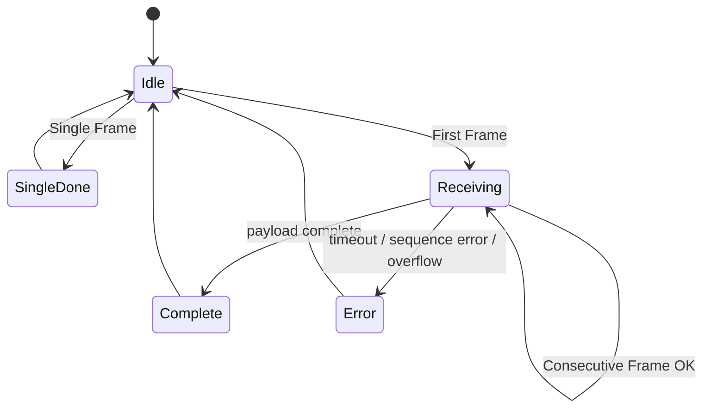

# 07 - ISO-TP

## Contents

- [Overview](#overview)
- [Frame types](#frame-types)
- [Current state](#current-state)
- [State machine](#state-machine)
- [Error handling](#error-handling)
- [References](#references)

## Overview

ISO-TP, ISO 15765-2, transports diagnostic payloads larger than one CAN frame. It is required for VIN, DTCs and many UDS responses.

## Frame types

| Type | Meaning |
| --- | --- |
| Single Frame | Entire payload fits into one CAN frame. |
| First Frame | Starts a multi-frame response and declares total length. |
| Consecutive Frame | Continues a multi-frame payload with sequence numbers. |
| Flow Control | Receiver tells sender whether to continue, wait or abort. |

## Current state

`lib/isotp/` contains `IsoTpHandler`, `IsoTpReassembler` and related types. Tests cover single frame, multi-frame, sequence errors and simulation scenarios.

## State machine

## Error handling

The implementation should detect and log:

- timeout waiting for a frame,
- sequence mismatch,
- invalid PCI type,
- declared length overflow,
- duplicate/unexpected frames,
- flow control overflow/abort.

UDS `0x78 ResponsePending` is not an ISO-TP error. It is a diagnostic negative response handled by the UDS layer.

## References

- [OBD](08_OBD.md)
- [UDS](09_UDS.md)
- [Simulation](17_Simulation.md)

