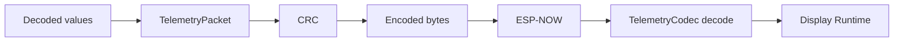

# 10 - Telemetry

## Contents

- [Overview](#overview)
- [Packet principles](#packet-principles)
- [Current state](#current-state)
- [Data model](#data-model)
- [Heartbeat](#heartbeat)
- [Compatibility rules](#compatibility-rules)

## Overview

Telemetry is the protocol between sender and display. It must be stable, versioned and validated.

## Packet principles

Every packet should carry:

- magic number,
- protocol version,
- packet type,
- sequence number,
- timestamp,
- payload,
- CRC.

## Current state

`lib/telemetry/` contains packet and codec logic. `lib/common/protocol.*` still contains compatibility utilities used by both sides.

## Data model

## Heartbeat

Heartbeat packets are mandatory even without OBD data. The display uses them to distinguish:

- sender not reachable,
- sender reachable but OBD inactive,
- sender reachable but CAN faulted,
- simulation active.

## Compatibility rules

- Sender and display must use the same protocol version.
- New fields should be additive where possible.
- Unknown values should render as `--` or `N/A`.
- Sequence gaps should increment packet loss counters.

