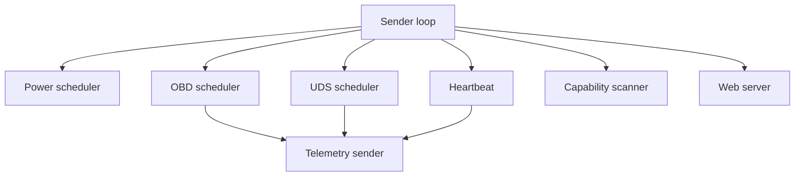

# 13 - Sender

## Contents

- [Overview](#overview)
- [Current state](#current-state)
- [Schedulers](#schedulers)
- [LED and button](#led-and-button)
- [Web console](#web-console)
- [Target state](#target-state)

## Overview

The sender is the vehicle-facing firmware. It initializes CAN, polls OBD/UDS, collects runtime status and sends telemetry.

## Current state

Sender code is already split into modules:

- `SenderObdScheduler`
- `SenderUdsScheduler`
- `SenderHeartbeat`
- `SenderTelemetry`
- `SenderEspNow`
- `SenderCanAlerts`
- `SenderPowerScheduler`
- `SenderSimulationScheduler`
- `SenderLedButton`
- `SenderCapabilityScanner`

## Schedulers

Schedulers must not block each other. Live OBD values and heartbeat have higher priority than UDS scans and CAN sniffing.

## LED and button

LED state is derived from sender runtime. Button LED test must be temporary and must not overwrite the underlying state.

## Web console

The web console must never be required for normal auto-start operation unless `SenderConfig::RequireWebStart` is explicitly enabled.

## Target state

Sender runtime should expose snapshots to web/display, while low-level modules stay unaware of HTML and UI concepts.

