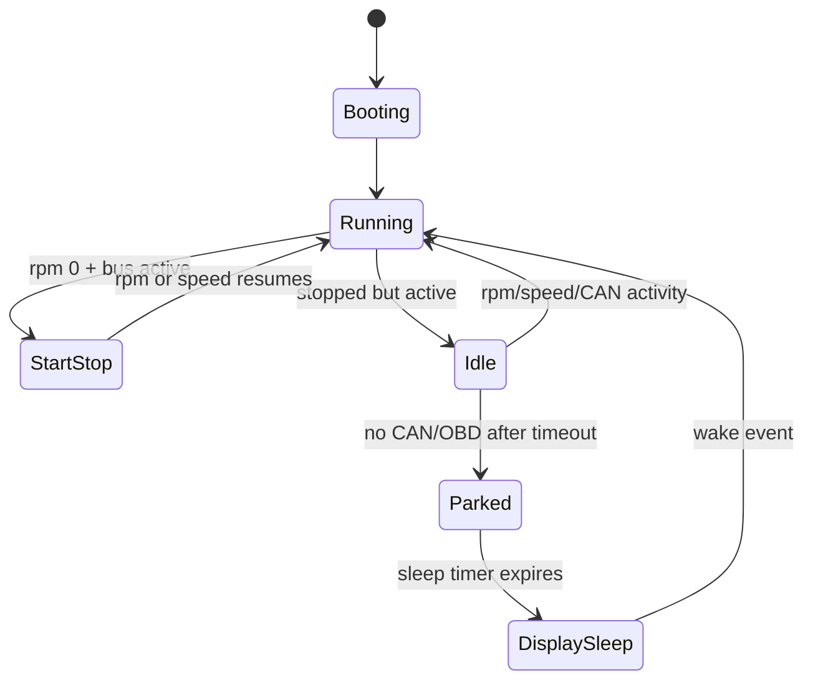

# 14 - Power Manager

## Contents

- [Overview](#overview)
- [Current state](#current-state)
- [Vehicle states](#vehicle-states)
- [Activity scoring](#activity-scoring)
- [Start-stop handling](#start-stop-handling)
- [Display commands](#display-commands)

## Overview

Power management decides whether the vehicle is running, idle, in start-stop, parked or ready for display sleep.

## Current state

`lib/power/ActivityMonitor.*` evaluates activity. Sender power scheduler sends power-related telemetry.

## Vehicle states

## Activity scoring

Signals:

- CAN activity,
- OBD response,
- RPM,
- speed,
- voltage,
- engine load,
- throttle,
- display button activity,
- simulation.

No single signal should decide the full state alone.

## Start-stop handling

RPM `0` does not mean parked. If CAN/OBD and board voltage are active, this is likely start-stop or idle. Display sleep is only allowed after parked detection.

## Display commands

Power commands are sent through telemetry:

- none,
- sleep,
- wakeup,
- optional dim.

The display keeps ESP-NOW active during low-power display states.

