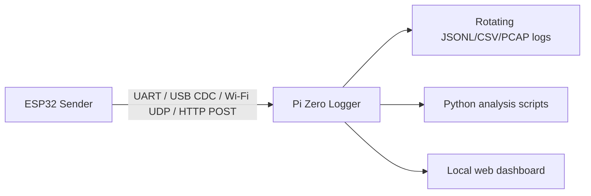

# 28 - Audit Work Items

## Contents

- [Purpose](#purpose)
- [Audit summary](#audit-summary)
- [GitHub issue mapping](#github-issue-mapping)
- [Issue-ready work items](#issue-ready-work-items)
- [Pi Zero logging extension](#pi-zero-logging-extension)
- [Display improvement direction](#display-improvement-direction)
- [Configuration and web-control candidates](#configuration-and-web-control-candidates)
- [Security notes](#security-notes)
- [How to convert this file into GitHub issues](#how-to-convert-this-file-into-github-issues)

## Purpose

This document captures the current repository audit as concrete, issue-ready work items. It focuses on:

- duplicate or legacy code,
- unnecessary or confusing code paths,
- security risks,
- display improvements,
- comments and maintainability,
- runtime settings that should move behind config flags or web controls,
- optional Raspberry Pi Zero logging.

The file is intentionally written like a backlog. Each section can become a GitHub issue when work starts.

## Audit summary

### Duplicate or legacy code

Current findings:

- Legacy public headers still exist in `include/`, for example `CANHandler.h`, `OBDHandler.h`, `OTAHandler.h`, `UpdateManager.h`, `TelemetryProtocol.h`, `SimulationData.h`, `CANDecoder.h` and `PID_Converter.h`.
- Some of those headers are valid compatibility wrappers, but some names overlap with newer modules in `lib/`.
- `lib/common/protocol.*` and `lib/telemetry/*` both exist. The intended canonical telemetry path is `lib/telemetry`; the old protocol helper should be explicitly marked as compatibility-only or removed after migration.
- `src/sender/CANHandler.cpp` and `lib/can_router/*` are both involved in CAN handling. This is not necessarily wrong: `CANHandler` owns TWAI hardware, `CanRouter` fans out frames. The boundary should be documented in comments.
- `src/display/DisplayUi.cpp` still uses function names such as `drawMainPageV2()`. There is no active PageV1/PageV2 choice anymore, so the suffix is misleading.

Risk:

- Future changes may accidentally use old compatibility APIs instead of canonical modules.
- Developers may add new logic to the wrong layer.

### Non-essential or confusing code

Current findings:

- `src/display/DisplayUi.cpp` is a large monolith and contains glyph drawing, widgets, page layout, button handling helpers and rendering state in one file.
- `src/sender/WebConsoleHandler.cpp` mixes HTML, JavaScript, REST API handlers, OTA handling and status JSON assembly.
- `src/sender/SenderCapabilityScanner.cpp` is large and combines scanner state machines, CAN sniffer export and JSON generation.
- `include/Logger.h` is header-only, mixes Serial output with sink forwarding and still contains mixed German comments plus typo-like comments such as critical/debug wording.
- Several JSON payloads are built by manual `String` concatenation. Existing `jsonEscape()` helps, but a shared JSON helper would reduce risk.

### Security risks

Current findings:

- `SecurityConfig::BlockNetworkFeaturesOnPlaceholderSecrets` is currently `false` for commissioning. This allows use with `secrets.example.h`, but it exposes known example credentials if the device is reachable.
- WLAN credentials entered through the web UI are stored in ESP32 Preferences. This is practical, but it is not encrypted storage.
- Basic Authentication is suitable for a local SoftAP, but not for untrusted networks.
- GitHub update TLS root CA is pinned/configured, which is good, but CA rotation must be documented and testable.
- Web endpoints for restart, OTA, simulation and Wi-Fi configuration are protected by shared authentication helpers. These should stay covered by tests.

### Display improvement opportunities

Current findings:

- The display page set is now compact, but the layout still looks technical and cramped on some pages.
- Missing values must remain visually neutral; they must not produce green OK boxes.
- CAN/UDS diagnostic pages should show more raw identifiers, HEX bytes and scan state because that is useful in the vehicle.
- A consistent theme system does not yet exist.

### Comment quality

Current findings:

- Some comments explain obvious syntax instead of protocol intent.
- Some older German comments remain in code. The documentation says public code comments should be English where possible.
- Critical protocol areas need comments that explain *why*, especially ISO-TP timeouts, UDS `0x78 ResponsePending`, OTA target checks and CAN router boundaries.

## GitHub issue mapping

The audit items are mirrored as GitHub issues:

| Audit item | GitHub issue |
| --- | --- |
| AUDIT-001 | [#9](https://github.com/SpecterAoD/CANOBD2Reader/issues/9) |
| AUDIT-002 | [#10](https://github.com/SpecterAoD/CANOBD2Reader/issues/10) |
| AUDIT-003 | [#11](https://github.com/SpecterAoD/CANOBD2Reader/issues/11) |
| AUDIT-004 | [#12](https://github.com/SpecterAoD/CANOBD2Reader/issues/12) |
| AUDIT-005 | [#13](https://github.com/SpecterAoD/CANOBD2Reader/issues/13) |
| AUDIT-006 | [#14](https://github.com/SpecterAoD/CANOBD2Reader/issues/14) |
| AUDIT-007 | [#15](https://github.com/SpecterAoD/CANOBD2Reader/issues/15) |
| AUDIT-008 | [#16](https://github.com/SpecterAoD/CANOBD2Reader/issues/16) |
| AUDIT-009 | [#17](https://github.com/SpecterAoD/CANOBD2Reader/issues/17) |
| AUDIT-010 | [#18](https://github.com/SpecterAoD/CANOBD2Reader/issues/18) |
| AUDIT-011 | [#19](https://github.com/SpecterAoD/CANOBD2Reader/issues/19) |
| AUDIT-012 | [#20](https://github.com/SpecterAoD/CANOBD2Reader/issues/20) |
| AUDIT-013 | [#21](https://github.com/SpecterAoD/CANOBD2Reader/issues/21) |

## Issue-ready work items

### AUDIT-001 - Mark or remove legacy compatibility headers

Priority: High

Scope:

- `include/CANHandler.h`
- `include/OBDHandler.h`
- `include/OTAHandler.h`
- `include/UpdateManager.h`
- `include/TelemetryProtocol.h`
- `include/SimulationData.h`
- `include/CANDecoder.h`
- `include/PID_Converter.h`

Work:

1. Decide for each header whether it is canonical, compatibility-only or removable.
2. Add a short header comment for compatibility-only files.
3. Remove unused compatibility headers only after `rg` confirms no include path depends on them.
4. Update `docs/02_Project_Structure.md`.

Acceptance criteria:

- No unclear duplicate module ownership remains.
- Sender, display and native tests still build.
- New code has one obvious include path per subsystem.

### AUDIT-002 - Split DisplayUi into pages, widgets and theme helpers

Priority: High

Scope:

- `src/display/DisplayUi.cpp`
- future `lib/ui/` or `src/display/ui/`

Work:

1. Rename `draw*PageV2()` functions to current names.
2. Extract reusable metric/status widgets.
3. Extract theme/color constants and layout dimensions.
4. Keep the current eight-page behavior unchanged.
5. Add comments for layout decisions and missing-value behavior.

Acceptance criteria:

- `DisplayUi.cpp` becomes orchestration, not the entire UI.
- No page shows empty green OK boxes.
- Main page remains fast and readable while driving.

### AUDIT-003 - Improve display design for driving and diagnostics

Priority: High

Scope:

- Main page
- compact diagnostics
- UDS/DTC page
- CAN sniffer page
- additional values page

Work:

1. Introduce a consistent header/status strip with ESP-NOW, CAN, OBD and DTC.
2. Use larger typography for the two most important page values.
3. Reduce borders and visual noise.
4. Show raw CAN ID/DLC/HEX bytes on CAN page when no decoded signal is known.
5. Show UDS NRC and pending/backoff counters clearly.

Acceptance criteria:

- Missing data is muted/grey.
- Warnings and critical states are clearly orange/red.
- Diagnostic pages provide useful vehicle-test data without opening the web UI.

### AUDIT-004 - Split WebConsoleHandler into shared page assets and endpoint modules

Priority: High

Scope:

- `src/sender/WebConsoleHandler.cpp`
- `lib/web/WebAssets.*`
- `lib/web/WebRuntimeHandlers.*`

Work:

1. Move reusable HTML/JS fragments to `lib/web/WebAssets`.
2. Move status JSON creation into shared helpers.
3. Keep sender-specific endpoint registration in sender code.
4. Add comments for dangerous endpoints: OTA, restart, Wi-Fi credentials, simulation.

Acceptance criteria:

- WebConsoleHandler is shorter and easier to audit.
- Sender/display web behavior remains compatible.
- Authentication is checked before every sensitive action.

### AUDIT-005 - Harden Wi-Fi credential storage and web Wi-Fi configuration

Priority: High

Scope:

- `lib/network/WifiCredentialStore.*`
- `lib/web/AuthHelpers.*`
- `include/config/SecurityConfig.h`
- sender web UI

Work:

1. Add a config flag for allowing/disallowing persistent Wi-Fi credential storage.
2. Consider optional encrypted NVS if feasible for ESP32 Arduino.
3. Show a warning when credentials are stored.
4. Ensure no password is ever returned in status JSON.
5. Add a test for credential status JSON redaction.

Acceptance criteria:

- Web UI can configure WLAN/hotspot access without exposing the password later.
- Persistent storage can be disabled by config.
- Placeholder-secret commissioning mode is visibly warned in the web UI and docs.

### AUDIT-006 - Revisit placeholder-secret commissioning mode

Priority: High

Scope:

- `SecurityConfig::BlockNetworkFeaturesOnPlaceholderSecrets`
- README/security docs
- web security warning status

Work:

1. Decide whether the default should remain `false` during development or become `true` for release builds.
2. Add build-flag override for CI/development firmware if needed.
3. Show warning in `/status` and web UI when placeholders are active.
4. Add/extend native security tests.

Acceptance criteria:

- Release firmware cannot silently ship with example credentials.
- Development/test firmware remains convenient when explicitly configured.

### AUDIT-007 - Replace manual JSON string building with shared JSON helpers

Priority: Medium

Scope:

- `src/sender/WebConsoleHandler.cpp`
- `src/sender/SenderCapabilityScanner.cpp`
- `lib/update/UpdateManifest.cpp`
- `lib/network/WifiStationManager.cpp`

Work:

1. Create small `lib/web/JsonWriter` or use existing ArduinoJson consistently.
2. Centralize string escaping and comma handling.
3. Add tests for escaping and malformed values.

Acceptance criteria:

- No hand-written comma juggling in complex JSON responses.
- All user/input-derived strings are escaped.

### AUDIT-008 - Improve Logger comments and logging architecture

Priority: Medium

Scope:

- `include/Logger.h`
- `lib/logging/*`

Work:

1. Replace mixed German comments with concise English comments.
2. Fix typo-like comments.
3. Document the difference between Serial logging, persistent diagnostic log and telemetry diagnostics.
4. Consider moving inline implementation from header to `lib/logging/Logger.cpp`.

Acceptance criteria:

- Logger comments explain intent, not obvious syntax.
- Logging levels are consistent.
- No accidental noisy logging on performance-critical OBD paths unless enabled.

### AUDIT-009 - Add runtime web controls for tuning without reflashing

Priority: Medium

Candidate controls:

- OBD fast poll interval.
- OBD slow poll interval.
- raw CAN telemetry on/off.
- CAN raw telemetry rate.
- persistent telemetry payload logging on/off.
- display page enable/disable.
- display brightness/dimming.
- UDS scan max requests/minute.
- capability scan aggressiveness.
- update channel and auto-install mode.
- placeholder-secret network blocking in development builds only.

Work:

1. Separate safe runtime controls from compile-time safety controls.
2. Keep defaults in config.
3. Use web controls for runtime-only values.
4. Avoid persistent storage until explicitly designed.

Acceptance criteria:

- Vehicle testing can tune diagnostic load without rebuilding firmware.
- Safety-critical settings remain conservative by default.

### AUDIT-010 - Pi Zero extended logging companion

Priority: Medium

Goal:

Use a Raspberry Pi Zero as an optional companion logger for long vehicle sessions and richer analysis.

Possible architecture:



Recommended transport options:

1. **USB serial from sender to Pi Zero**
   - Pros: simple, reliable, isolated from ESP-NOW/Wi-Fi channel issues.
   - Cons: requires physical USB/UART wiring.
2. **Wi-Fi UDP log stream**
   - Pros: easy to add, low overhead.
   - Cons: packet loss possible; must not interfere with ESP-NOW.
3. **HTTP batch upload**
   - Pros: robust metadata, easy files.
   - Cons: more overhead and less real-time.

Suggested first implementation:

- Add optional `ExternalLogSink` interface on sender.
- Stream line-oriented JSONL over UART or UDP.
- Include timestamp, sequence, source, CAN ID, payload HEX, OBD PID, UDS service, status and error counters.
- Pi Zero stores rotating files and exposes a tiny local dashboard.

Acceptance criteria:

- Sender continues working if Pi Zero is absent.
- External logging is disabled by default.
- Logging cannot block OBD/ESP-NOW.
- Raw CAN logs can be correlated with web diagnostic snapshots.

### AUDIT-011 - Document CAN router ownership and listener rules

Priority: Medium

Work:

1. Add comments to `CANHandler` and `CanRouter` explaining ownership:
   - `CANHandler`: TWAI hardware read/write lifecycle.
   - `CanRouter`: fan-out to passive listeners.
2. Document that modules must not call `twai_receive()` directly outside the owning CAN path.
3. Add a native test or static check where practical.

Acceptance criteria:

- No new subsystem can accidentally steal CAN frames from OBD/UDS.

### AUDIT-012 - Capability scanner UX and safety pass

Priority: Medium

Work:

1. Make scan buttons show immediate state changes.
2. Add progress and last error for OBD PID scan, UDS scan and CAN sniffer.
3. Add conservative scan presets.
4. Add a clear warning for UDS scans while driving.

Acceptance criteria:

- The user can tell whether a button worked.
- Scans are manually started/stopped and never aggressive by default.

### AUDIT-013 - Add code comments for protocol edge cases

Priority: Medium

Files/areas:

- ISO-TP First Frame / Consecutive Frame reassembly.
- UDS `0x78 ResponsePending`.
- OBD physical fallback from `0x7DF` to `0x7E0`.
- OTA target/schema/protocol validation.
- Display timeout and severity rules.

Acceptance criteria:

- A new developer understands why timeouts/backoff/fallbacks exist.
- Comments describe intent and constraints, not line-by-line mechanics.

## Pi Zero logging extension

The Pi Zero should not replace ESP32 persistent logs. It should be an optional high-capacity companion logger.

Recommended staged approach:

1. Define a `LogRecord` JSONL schema.
2. Add a non-blocking sender-side external log sink.
3. Implement UART first because it avoids Wi-Fi/ESP-NOW coupling.
4. Add a Python Pi logger service.
5. Add offline analysis scripts for CAN ID frequency, byte-diff candidates and OBD/UDS timeout correlation.

Example JSONL record:

```json
{"t":123456,"seq":42,"src":"can","id":"0x7E8","dlc":8,"data":"04410C1AF8555555","hint":"OBD RPM response"}
```

## Display improvement direction

Recommended visual direction:

- Main page: fewer boxes, larger speed/RPM, small status strip.
- Engine page: temperature-focused with color severity.
- Consumption/trip page: show missing values as muted and explain unavailable fuel inputs.
- Diagnostics page: compact counters, heartbeat age, packet loss and firmware.
- UDS/DTC page: VIN, ECU count, last service, last NRC and DTC list.
- CAN page: raw ID/DLC/HEX lines, last changed ID and sniffer state.
- Additional page: MAF/MAP/BARO/ambient/runtime values.

Avoid:

- green frames around unavailable values,
- too many equal-sized boxes,
- standalone novelty pages that displace diagnostics.

## Configuration and web-control candidates

Keep compile-time config for:

- pins,
- target identity,
- OTA partition assumptions,
- safety defaults,
- protocol constants.

Prefer web/runtime controls for:

- diagnostic verbosity,
- OBD scan rate,
- raw CAN telemetry rate,
- simulation scenario,
- selected update channel,
- display brightness,
- capability scan preset,
- external logging sink enable.

## Security notes

Current acceptable constraints:

- Local SoftAP Basic Auth is acceptable for commissioning.
- GitHub updates must keep target/protocol/SHA256 validation.
- Placeholder secrets may be useful during early bring-up.

Current risks to reduce:

- Do not expose devices to untrusted networks with placeholder credentials.
- Avoid returning secrets in JSON.
- Make persistent WLAN credentials optional and clearly documented.
- Consider signed manifests/firmware metadata as a long-term release hardening step.

## How to convert this file into GitHub issues

Recommended process:

1. Create one GitHub issue per `AUDIT-xxx` item.
2. Use labels:
   - `audit`
   - `security`
   - `display`
   - `web`
   - `logging`
   - `architecture`
   - `hardware-test`
3. Copy the priority and acceptance criteria into the issue.
4. Link PRs back to the issue.

Do not open all issues as urgent work. Suggested first issues:

1. `AUDIT-006` placeholder-secret release safety.
2. `AUDIT-002` split DisplayUi.
3. `AUDIT-003` improve display diagnostics.
4. `AUDIT-004` split WebConsoleHandler.
5. `AUDIT-010` Pi Zero logging design spike.
