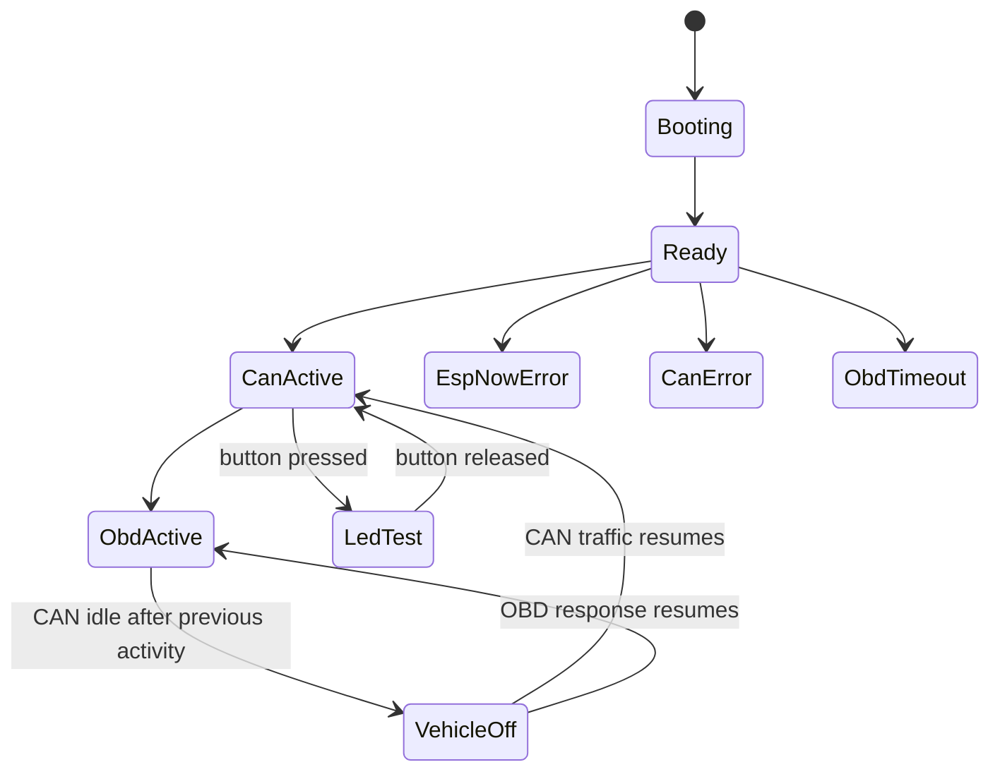

# Sender LED States

## Contents

- [Purpose](#purpose)
- [LED meaning](#led-meaning)
- [State table](#state-table)
- [Important behavior](#important-behavior)
- [Troubleshooting](#troubleshooting)

## Purpose

The sender LEDs indicate the firmware state only. They are not a replacement for
the web diagnostics page. The green LED primarily means that the sender firmware
is alive and running. CAN, OBD and ESP-NOW details are shown by state names,
blink patterns and the second/error LED.

## LED meaning

- **Green LED**: sender alive / normal operating state.
- **Error LED**: communication or CAN fault.
- **LED test button**: temporarily turns all LEDs on without changing the
  current logical state.

## State table

| State | Green LED | Error LED | Meaning |
| --- | --- | --- | --- |
| `Booting` | slow blink | off | Firmware has started, sender is not fully running yet. |
| `Ready` | on | off | Sender is running, ESP-NOW is ready, no active CAN/OBD error. |
| `CanActive` | on | off | CAN traffic was detected. |
| `ObdActive` | on | off | Valid OBD response was recently received. |
| `VehicleOff` | slow blink | off | CAN was seen before, but is currently idle. This is expected after vehicle shutdown. |
| `ObdTimeout` | fast blink | off | OBD requests currently time out while the sender is otherwise alive. |
| `EspNowError` | off | fast blink | ESP-NOW transport is not ready or send errors are active. |
| `CanError` | off | on | CAN driver is not ready or CAN error state is active. |
| `LedTest` | on | on | Button test mode. Ends automatically when the button is released. |

## Important behavior

After `VehicleOff`, the green LED must return to `on` when CAN traffic or OBD
responses resume. A parked vehicle must not leave the LED controller stuck in an
old off state.

The LED test never overwrites the real state permanently:

## Troubleshooting

If the sender works but the green LED remains off after the car was parked:

1. Open the sender web console.
2. Check `LED state`, `VehicleOff`, `CAN active`, `OBD active` and `ESP-NOW`.
3. If CAN/OBD is active but the LED state remains `VehicleOff`, the LED state
   transition is wrong.
4. If CAN is `IDLE` and OBD is not responding, the LED behavior is expected.

